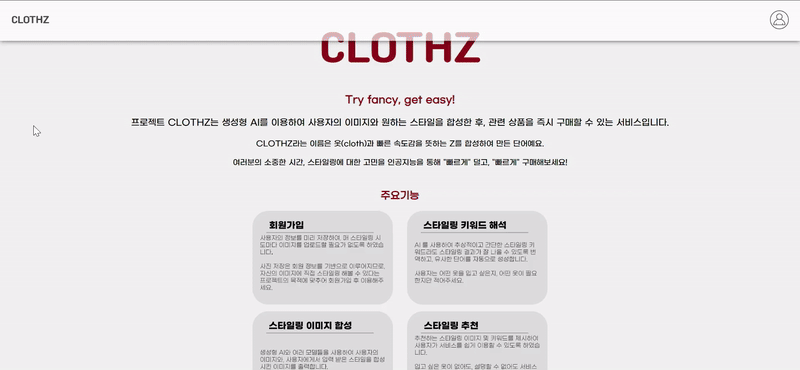

# ✨ AI Styling Project
 
온라인에서 옷을 구매하면서 '내가 저 옷을 입어보면 어떤 느낌일까'라는 생각을 해보신 적이 있나요? 

이런 상상을 현실로 만들어보고 싶어서 생성형 AI를 활용해서 가상 스타일링 서비스를 기획 및 개발하게 되었습니다.

만약 자신의 사진과 원하는 스타일을 문장으로 입력하면 가상 스타일링된 이미지를 받아볼 수 있습니다!

## 🖥️ 프로젝트 구현 화면

<table>
<tr >
<td align="center">
메인 화면 ~ 이미지 생성 로딩 화면
</td>
</tr>
<tr>
<td> 
      
</td>
</tr>
<td align="center">
이미지 생성 로딩 화면 ~ 연관 상품 추천
</td>
<tr>
<td align="center">
      
    </td>
</tr>
</table>

## 👻 제작 기간 & 참여 인원
- 2024년 3월 18일 ~ 6월 12일
- 팀 프로젝트(소프트웨어 공학과 캡스톤)
    - 참여 인원 6명(프론트 3명, 백엔드 3명) 
- 담당한 역할
  - 서비스 기획 담당
  - 백엔드 팀 리드 담당
   

## 🛠️ 기술
### `Back-end`
- **Java 17**
- **Spring Boot 3.1.4**
- **Gradle**
- **Spring Data JPA**
- **QueryDSL**
- **H2**
- **MySQL 8.0.33**
- **JUnit5**
- **Spring Security**
- **Spring Webflux**

### `Infra`
- **Docker**
- **GitHub Actions**
- **AWS EC2**
- **AWS RDS**
- **AWS S3**
- **AWS SQS**
- **AWS Lambda**
- **AWS SageMaker**

## 🔎 프로젝트 구조

<table>
<tr >
<td align="center">
프로젝트 아키텍처
</td>
</tr>
<tr>
<td> 
      
</td>
</tr>
</table>

## 🚀 맡은 역할 및 기능 소개
이 프로젝트에서 제가 역할을 맡은 파트는 크게 5가지로 나눌 수 있습니다.

1. 스프링 서버와 AI 서버 간 통신
2. 스프링 서버와 외부 API 간 통신
3. CI/CD 파이프라인 구축
4. AI 모델 배포 및 AI 서버 구축 
5. 테스트 코드

### 1. 스프링 서버와 AI 서버 간 통신 📌 [코드 확인](https://github.com/boseungk/Capstone-BackEnd/blob/main/src/main/java/com/clothz/aistyling/api/service/styling/StylingService.java)

----------------------------------------------

- **AWS SQS(Simple Queue Service)를 이용한 서버 간 통신 구현** 
  - AWS SQS를 이용하여 메시지 큐 기반으로 서버 간 통신이 이뤄집니다.
  - AI 서버의 응답을 별도의 SQS 큐(responseQueue)로 수신합니다.
- **응답 메시지를 비동기적으로 처리**
  - 메시지 큐의 장점을 살리기 위해 CompletableFuture를 사용하여 비동기(non-blocking) 방식으로 요청을 처리합니다.
  - ConcurrentLinkedQueue로 응답의 순서를 관리합니다.

### 2. 스프링 서버와 외부 API 간 통신 📌 [코드 확인](https://github.com/boseungk/Capstone-BackEnd/blob/main/src/main/java/com/clothz/aistyling/api/service/recommendation/RecommendService.java)

----------------------------------------------

- **Webclient를 이용한 외부 API 간 통신 구현**
  - Webclient로 HTTP 기반으로 외부 API(Google lens 관련 API) 통신합니다.
  - 스레드 자원을 효율적으로 사용하기 위해 비동기(non-blocking) 방식으로 통신합니다.

### 3. CI/CD 파이프라인 구축 📌 [코드 확인](https://github.com/boseungk/Capstone-BackEnd/blob/main/.github/workflows/deployment.yml)

----------------------------------------------

- **GitHub Actions와 Docker 기반 CI/CD 구축**
  - CI/CD 파이프라인을 구축하여, 코드의 변경사항이 발생하면 자동으로 빌드 및 배포가 이뤄집니다.

### 4. AI 모델 배포 및 AI 서버 구축 

----------------------------------------------

- **AWS Sagemaker를 통해 PhotoMaker 모델 배포** 📌 [코드 확인](https://github.com/boseungk/Capstone-BackEnd/blob/main/ai/sagemaker_notebook_success.ipynb)
  - AWS Sagemaker를 통해 PhotoMaker 모델을 배포하고 엔드포인트를 생성합니다.
- **AWS Lambda를 통한 AI 서버 구축** 📌 [코드 확인](https://github.com/boseungk/Capstone-BackEnd/blob/main/ai/lambda.py)
  - AWS Lambda를 활용하여 배포된 모델의 엔드포인트로 통신합니다
  - 사용자의 요청 값을 Google Gemini API를 활용하여 입력 프롬프트에 적합하게 재구성합니다.

### 5. 테스트 코드 📌 [코드 확인](https://github.com/boseungk/Capstone-BackEnd/tree/main/src/test/java/com/clothz/aistyling)

----------------------------------------------

- **테스트 코드 작성** 
  - 가능한 모든 코드에 단위 테스트, 통합 테스트 코드를 작성하여 서비스 개발의 안정성을 확보하고자 했습니다.
  - 커버리지(메서드, 라인) 77%를 달성했습니다.
  

## 🔥 핵심 트러블 슈팅

### 1. Spring 서버와 AI 서버 간 통신 시 타임아웃 문제
- **문제 상황**
  - 처음 Spring 서버와 AI 서버 간 통신을 구현할 때, API Gateway를 통해 AWS Lambda와 통신을 주고 받으려고 했습니다.
  - API Gateway의 타임아웃이 30초로 설정되어 있었지만, 이미지 생성에 1분 가량 소요 되었기 때문에 문제가 발생했습니다.
- **해결 방법**
  - AWS SQS를 이용하여 메시지 큐 기반으로 서버 간 통신을 구현했습니다.
    - AWS SQS 3.0 버전은 참고할만한 자료가 별로 없어서 공식 문서를 최대한 활용했습니다.
  - 스레드 자원을 효율적으로 사용하기 위해 CompletableFuture로 비동기적으로 요청을 처리하도록 구현했습니다.
  - 서버 내부에서는 ConcurrentLinkedQueue로 응답을 관리하도록 했습니다.
- **관련 블로그 글**
  - [AWS SQS를 이용한 서버 간 통신 구현하기]()

### 2. 스프링 서버와 외부 API 간 통신 시 동기 문제
- **문제 상황**
  - 외부 API(Google lens 관련 API)와 통신할 때, RestTemplate를 사용하여 통신 하려고 했습니다.
  - 하지만 RestTemplate이 동기적으로 요청을 처리한다는 것을 알게 되고, 마찬가지로 비동기적으로 요청을 처리할 방법을 고민하게 되었습니다.
- **해결 방법**
  - Webclient는 Reactor Netty를 기반으로 하여 비동기 방식으로 요청을 처리한다는 것을 알게 되어 외부 API 통신을 Webclient을 사용하게 되었습니다.
- **관련 블로그 글**
  - [Webclient를 이용한 외부 API 비동기 통신 구현하기]()
  
### 3. AI 모델 배포 및 AI 서버 구축
- **문제 상황**
  - 처음에는 OpenAI API를 활용하여 간단하게 이미지 생성을 구현하려고 했습니다.
  - 하지만 사용자 요구사항에 맞지 않는다는 피드백을 받고, 직접 AI 모델을 배포하는 방향으로 변경하게 되었습니다.
- **해결 방법**
  - AWS Sagemaker를 통해 PhotoMaker 모델을 배포하고 엔드포인트를 생성했습니다.
  - AWS Lambda를 활용하여 배포된 모델의 엔드포인트로 통신하도록 구현했습니다.
- **관련 블로그 글**
  - [AWS Sagemaker 및 AWS Lambda를 통해 AI 서버 배포하기]()
  
----------------------------------------------

## 💣 기타 트러블 슈팅

 CI/CD 파이프라인 구축 시 시크릿 키 문제

- **문제 상황**
  - CI/CD 파이프라인을 Github Actions로 구축하면서 중요한 시크릿 키는 환경변수로 설정하려고 했습니다.
  - 하지만 Github에서 환경 변수로 시크릿 키를 설정해도 배포에 실패하는 문제가 발생했습니다.
- **해결 방법**
  - Github Actions에서 로그를 자세히 살펴보면서 Spring이 특정한 환경 변수만을 제대로 읽지 못한다는 것을 알게 되었습니다.
  - 결국 Docker에 Github Actions에 설정한 환경변수가 제대로 전달되지 않아서 발생한 문제라는 것을 깨닫고 `docker run -e` 옵션으로 도커의 환경 변수를 설정해줘서 문제를 해결 할 수 있었습니다.
  - 이후에는 `docker-compse`를 사용해서 환경 변수를 설정하도록 변경했습니다.

 

 

 테스트 코드 작성 시 테스트 종속성 문제

- **문제 상황**
  - 회원 정보 조회에 대한 테스트 코드 작성 시 개별적으로 테스트는 성공하지만, 전체 테스트 실행 시 테스트에 실패하는 문제가 발생했습니다.
- **해결 방법**
  - 테스트 간의 독립성이 보장되지 않아서 발생한 문제라는 것을 의심한 결과 결국 id에 auto_increment로 증가하고 있어서 발생한 문제라는 것을 알게 되었습니다.
  - `@DirtiesContext`로 테스트 간의 독립성을 보장하도록 변경했지만, 시간이 너무 오래 걸려서 다른 방법을 찾게 되었습니다.
  - entityManager를 사용하여 DELETE, ALTER 쿼리로 데이터베이스를 초기화하는 방법을 사용하게 되었습니다.

 

## 📅 회고 / 느낀점
>프로젝트 개발 회고 글: 